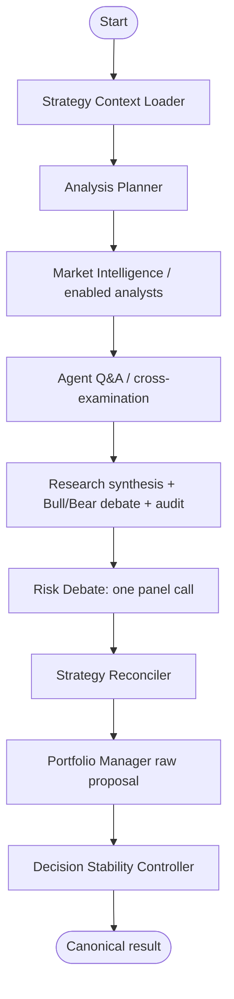

# TradingAgents AI — Multi-Agent Decision Engine

This package contains the LangGraph-based analysis engine used by the FastAPI application. Specialized analysts gather evidence, research stages challenge and consolidate it, one risk-panel node returns non-executable guardrails, the Portfolio Manager emits a raw structured proposal, and the deterministic Decision Stability Controller determines the canonical accepted decision used by the application layer.

Agent output is never a broker order by itself. Order execution remains subject to deterministic application-side cash, risk, exposure, broker, and trading-mode controls.

---

## Current workflow



The Risk Debate node makes one model call and requests aggressive, conservative, and neutral perspectives in one structured transcript. Those perspectives are not separate graph agents and do not own execution authority.

The exact node wiring is defined in `graph/setup.py` and `graph/trading_graph.py`.

---

## Package layout

```text
trading_agents/
├── agent_catalog.py         # Agent hierarchy and selection metadata
├── personas.py              # Investor persona catalog
├── config.py                # Engine runtime configuration
├── agents/
│   ├── analyst_registry.py  # Dynamic analyst registration and graph sync
│   ├── hierarchy.py         # Main-agent enablement and LLM resolution
│   ├── schemas.py           # Structured agent output schemas
│   ├── main/                # Main graph nodes
│   ├── sub/
│   │   ├── analysts/        # 12 specialist analyst plugins
│   │   ├── researchers/     # Bull/Bear research roles
│   │   └── managers/        # Research/Synthesis/Auditor/Portfolio helpers
│   ├── runtime/             # Shared analyst/debate/runtime helpers
│   ├── tools/               # Modular tool registry
│   ├── data/                # Tool/data execution helpers
│   └── utils/               # Shared agent utilities
├── graph/
│   ├── setup.py             # StateGraph wiring
│   ├── checkpointer.py      # PostgreSQL LangGraph checkpoint helpers
│   ├── conditional_logic.py # Dynamic analyst routing hooks
│   ├── propagation.py       # Initial graph state
│   └── trading_graph.py     # Graph runner and streaming hooks
├── dataflows/               # Vendor-routed market/data access
└── llm_clients/             # Unified provider clients and model catalog
```

PostgreSQL/LangGraph saver is the checkpoint system. There is no SQLite checkpoint compatibility fallback.

---

## Analyst stage

Analysts register with `@register_analyst` and are synchronized into the graph by the analyst registry. The current specialist set covers:

1. Market / Technical
2. Social Sentiment
3. News
4. Fundamentals
5. Macroeconomics
6. Options Chain
7. Quantitative Factor
8. Earnings Call
9. Performance Review
10. Catalyst
11. Insider Activity
12. Institutional Ownership

Analysts gather evidence through the modular tool/dataflow layer. They do not emit the final executable portfolio decision.

To add an analyst, follow the current registry pattern in `agents/sub/analysts/` and update `agent_catalog.py` for selection metadata. Do not hardcode analyst lists in the frontend; `/api/meta` is the UI source of truth.

---

## Research and risk stages

Research stages synthesize analyst evidence, expose contradictions, run Bull/Bear thesis debate, and audit claims before the Research Manager produces the evidence brief consumed downstream.

The Risk Debate node then asks one LLM call for three perspectives:

- **Aggressive** — upside conditions and risks accepted for a higher-risk stance.
- **Conservative** — downside, invalidation, liquidity, and capital-preservation concerns.
- **Neutral** — balanced synthesis and practical guardrails.

The panel is deliberately non-executable. It does not issue the final rating, quantity, allocation, entry, stop, target, or leverage.

---

## Strategy, proposal, and canonical decision

Before the Portfolio Manager, the Strategy Reconciler compares fresh evidence with the exact active/as-of asset strategy and proposes one of `KEEP`, `STRENGTHEN`, `WEAKEN`, `INVALIDATE`, or `REBUILD`.

The Portfolio Manager is the sole AI stage that produces the raw structured portfolio proposal. The proposal can contain rating, confidence, target allocation/capital, entry, stop, target, and leverage fields supported by the current schema.

The Decision Stability Controller then evaluates that proposal against prior accepted decision state, invalidations, independent evidence, quality, and calibrated confidence. Depending on configured mode it records a counterfactual (`shadow`) or makes the controller result canonical (`enforce`). Hard risk exits remain reduce-only.

The canonical structured application field is `portfolio_decision_json`. Execution code must not reconstruct the decision from chart annotations, old Trader fields, or raw PM proposal data.

---

## Modular tool registry

Agent tools are registered under `agents/tools/` and expose their own metadata/settings schema. Runtime tool access is resolved from user/system settings and agent reachability before execution.

Typical extension flow:

1. Implement/register a tool under `agents/tools/builtin/`.
2. Import it from `agents/tools/bootstrap.py` so registration occurs at startup.
3. Add localization strings for labels/settings.
4. Let `/api/meta` and settings metadata drive the frontend UI.

Pure Tier-3 data helpers may be called directly when no registry/permission boundary is required; agent-facing configurable tools should go through the registry.

---

## LLM provider layer

`llm_clients/registry.py` is the authoritative provider/model registry. The UI reads it through:

```text
GET /api/settings/llm-catalog
```

Registered providers include OpenAI, Anthropic Claude, Google Gemini, and NVIDIA NIM/OpenAI-compatible models. Provider-specific reasoning controls are mapped by the runtime client layer rather than hardcoded into graph nodes.

Token pricing is resolved by `backend/core/model_pricing.py` from the pinned LiteLLM catalog plus explicit overrides/fallback estimates when required.

---

## Checkpoints and Time Travel

LangGraph checkpoints are persisted in PostgreSQL and exposed through the checkpointer helpers in `graph/checkpointer.py`. Time Travel resumes from a stored graph checkpoint; retired graph topologies are not treated as resumable current checkpoints.

Checkpoint state is internal graph state, not an alternate application persistence format. Canonical analysis/report fields remain in `AnalysisResult`.

---

## Source-of-truth rule

When documentation conflicts with implementation, inspect these files first:

- `graph/setup.py`
- `graph/trading_graph.py`
- `agents/main/`
- `agents/analyst_registry.py`
- `agent_catalog.py`
- `agents/tools/`
- `llm_clients/registry.py`

Retired agent classes, old checkpoint formats, and roadmap-only ideas should not be reintroduced as compatibility layers unless a deliberate migration contract is approved.
