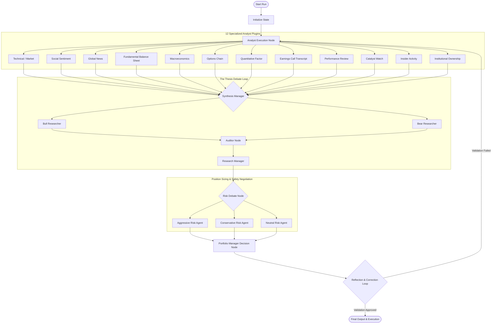

# 🤖 TradingAgents AI: Multi-Agent Decision Engine

This directory contains the core multi-agent AI system designed to analyze securities, conduct investment thesis debates, negotiate position sizing parameters under risk constraints, and execute final trades. 

Built using **LangGraph** and **LangChain Core**, the system models complex financial decision-making as a state machine with asynchronous execution, self-correction reflection loops, and streaming updates.

---

## 🧭 Multi-Agent Workflow Architecture

Instead of relying on a single, general-purpose LLM prompt to make investment decisions, TradingAgents splits work among specialized AI personas. The execution flow is structured as follows:



---

## 📁 Package Layout

```text
trading_agents/
├── agent_catalog.py         # Single source: agent hierarchy tree + selection metadata (AGENTS)
├── personas.py              # Single source: investor persona catalog
├── agents/                  # Prompt engineering, agent behaviors, and schemas
│   ├── analyst_registry.py  # Registry manager to load and execute analyst plugins
│   ├── schemas.py           # Structured output schemas (Pydantic models)
│   ├── base.py              # Shared agent contracts
│   ├── hierarchy.py         # AgentHierarchy: cascading kill-switches + LLM fallback resolution
│   ├── main/                # Tier-1 main graph nodes (market intelligence, agent Q&A,
│   │                        #   research, trade execution, risk, portfolio)
│   ├── sub/                 # Tier-2 sub-agents
│   │   ├── analysts/        # The 12 analyst plugins
│   │   ├── researchers/     # Bull & Bear thesis builders
│   │   ├── managers/        # Research, Synthesis, Auditor, and Portfolio managers
│   │   ├── risk_mgmt/       # Risk analyst personalities (Aggressive, Conservative, Neutral)
│   │   └── trader/          # Trader node logic
│   ├── runtime/             # Execution runtime helpers (resilience, memory,
│   │                        #   analyst_execution, analyst_node_factory)
│   ├── tools/               # Tier-3 modular tool registry (base, registry, bootstrap, builtin/)
│   ├── data/                # Data and tool execution helpers
│   └── utils/               # Shared utilities
├── graph/                   # State machine structure (LangGraph engine)
│   ├── setup.py             # Instantiates, compiles, and chains StateGraph nodes
│   ├── checkpointer.py      # Persists conversation states and node states
│   ├── conditional_logic.py # Defines dynamic routing criteria between nodes
│   ├── propagation.py       # Initial state construction
│   ├── signal_processing.py # Signal extraction from final decisions
│   ├── reflection.py        # Logic to review outputs for hallucination or errors
│   └── trading_graph.py     # Graph entry runner with stream event hooks
├── dataflows/               # Vendor-routed data access (yFinance, Alpha Vantage, Reddit, …)
└── llm_clients/             # Unified API clients & model catalog for all LLM providers
```

---

## 🔬 Core Components

### 1. Dynamic Analyst Registry
All analyst plugins inherit from a base analyst class and register dynamically via [analyst_registry.py](agents/analyst_registry.py). Each analyst is given access to tools (e.g. `yfinance`, web search via SearXNG, social media APIs) to compile an isolated PDF/text report and extract key quantitative signal metrics.

The 12 analysts are:
1.  **Market Analyst:** Pulls historical stock prices, calculates MACD, RSI, Moving Averages, and visualizes trends.
2.  **Social Sentiment Analyst:** Mines Reddit (e.g., r/wallstreetbets) and StockTwits for bullish/bearish mentions and volumes.
3.  **News Analyst:** Fetches global news feeds and ranks general news sentiment.
4.  **Fundamentals Analyst:** Downloads income statements, balance sheets, and cash flow statements to assess corporate health.
5.  **Macroeconomics Analyst:** Examines interest rates, inflation metrics, and GDP indicators.
6.  **Options Chain Analyst:** Analyzes open interest, call/put volume ratios, and implied volatility curves.
7.  **Quantitative Factor Analyst:** Executes statistical models, factor loadings, and returns anomalies.
8.  **Earnings Call Analyst:** Summarizes corporate earnings calls, management tone, and guidance changes.
9.  **Performance Review Analyst:** Compares historical agent suggestions against simulated returns to optimize weights.
10. **Catalyst Calendar Analyst:** Maps upcoming earnings, dividends, and event risk windows that could move the asset.
11. **Insider Activity Analyst:** Tracks executive insider buys and sells (SEC Form 4).
12. **Institutional Ownership Analyst:** Monitors 13F institutional and fund ownership changes.

### 2. The Thesis Debate & Synthesis
To avoid LLM bias, analyst reports are synthesized by the **Synthesis Manager** to identify key conflicts. These are then debated by the **Bull Researcher** and **Bear Researcher**.
*   **Auditor Node:** Before the final decision, an Auditor node fact-checks the debate transcript against original reports to prevent hallucinations.
*   **Research Manager:** Reviews both arguments and the Auditor's report to summarize verified claims.

### 3. Risk Management & Portfolio Allocation
The Research Manager's summary is evaluated by three risk personas:
*   **Aggressive Risk Agent:** Argues for larger position sizing and wider stop-losses to capture maximum upside.
*   **Conservative Risk Agent:** Focuses on downside risk, urging tight stop-losses, hedging strategies, or skipping the trade entirely.
*   **Neutral Risk Agent:** Seeks a balanced allocation target.
They negotiate a compromise on:
- **Signal Strength:** (Buy / Sell / Hold / Avoid)
- **Position Allocation Size:** Percentage of total available cash.
- **Stop Loss & Take Profit Levels.**

### 4. Self-Correcting Reflection Loop
Before publishing the final report, the **Reflection Node** checks the generated output:
- It verifies that the recommended actions comply with the portfolio limits.
- It scans for hallucinations (e.g., mismatched prices or tickers).
- If validation fails, it loops back to the analyst or researcher nodes with a refinement request.

### 5. Modular Agent Tool Registry and Runtime Flow
To support dynamic tool schema extraction and runtime tool activation, the platform decouples individual tools from the core agent execution:
*   **BaseAgentTool Class (`agents/tools/base.py`):** Individual tools (e.g., Reddit Sentiment, Macroeconomic Data) inherit from `BaseAgentTool`, defining their execution logic (`_run` / `_arun`), their target analyst nodes, and their configurable settings schema (`ToolSettingField`).
*   **Tool Registry (`agents/tools/registry.py`):** Acts as the source of truth for all tools. Standard tools are registered at bootstrap (`agents/tools/bootstrap.py`).
*   **Thread-Safe Context Injection (`graph/trading_graph.py`):** Before running the state machine, user-specific or system-default settings are loaded from the database and merged into a `runtime_tool_context`. This context is stored in the LangGraph thread configuration.
*   **Runtime Tool Adaptation (`agents/runtime/analyst_node_factory.py`):** In the analyst execution lifecycle (`run_tool_analyst`), the runtime filters active tools based on the context and adapts them dynamically into LangChain/LangGraph-compatible bindings.

### How to Register a New Agent Tool

To implement and register a new tool in the modular system, follow these steps:

1. **Implement the Tool Class:**
   Create a new file under `backend/trading_agents/agents/tools/builtin/` (e.g., `my_custom_tool.py`) extending `BaseAgentTool` or using `FunctionToolAdapter`:
   ```python
   from backend.trading_agents.agents.tools.base import BaseAgentTool, ToolSettingField, ToolContext
   from backend.trading_agents.agents.tools.registry import registry
   
   class MyCustomTool(BaseAgentTool):
       key = "my_custom_tool"
       category = "market"
       default_enabled = True
       allowed_analysts = ["market"]
       label_key = "tools.my_custom_tool.label"
       description_key = "tools.my_custom_tool.description"
       
       # Define the schema representing parameters the user/admin can configure:
       settings_schema = [
           ToolSettingField(
               key="max_items",
               type="number",
               scope="both",
               label_key="tools.my_custom_tool.max_items",
               default=10.0,
               min=1.0,
               max=100.0,
           )
       ]
       
       def get_langchain_tools(self, settings: dict, context: ToolContext) -> list:
           # Define or return standard LangChain @tool functions:
           from langchain_core.tools import tool
           
           limit = int(settings.get("max_items", 10))
           
           @tool
           def run_custom_query(query: str) -> str:
               """Run a custom analytical query."""
               return f"Results for '{query}' (limit: {limit})"
               
           return [run_custom_query]
           
   # Register it:
   registry.register(MyCustomTool())
   ```

2. **Add to Bootstrap Loader:**
   Import your module inside [backend/trading_agents/agents/tools/bootstrap.py](agents/tools/bootstrap.py) so it registers on server startup:
   ```python
   from .builtin import my_custom_tool
   ```

3. **Provide Localization Translations:**
   Add labels and descriptions in [tools.ts](../../frontend/src/i18n/tools.ts) for:
   * `tools.my_custom_tool.label`
   * `tools.my_custom_tool.description`
   * `tools.my_custom_tool.max_items`

---

## 🔌 LLM Provider Integration

The system uses [llm_clients/](llm_clients) to abstract away API differences.
Registered providers: **OpenAI**, **Anthropic Claude**, **Google Gemini**, and
**NVIDIA NIM** (OpenAI-compatible). The provider and per-provider model lists
are maintained in a single registry —
[llm_clients/registry.py](llm_clients/registry.py), served to the UI via
`GET /api/settings/llm-catalog` — so adding a provider or model is a one-place
change. Provider-specific reasoning controls (OpenAI reasoning effort, Gemini
thinking level, Claude effort) are mapped dynamically from the run
configuration.

---

## 🚀 Advanced Institutional Features

TradingAgents is designed for high-conviction, professional analysis through three core pillars:

1.  **SEC & Insider Intelligence:** The **Fundamentals Analyst** leverages specialized tools (`get_sec_filings`, `get_insider_transactions_deep`) to monitor regulatory filings (10-K, 10-Q) and Form 4 insider transactions to gauge management sentiment and regulatory risks.
2.  **Mathematical Risk Sizing:** The **Portfolio Manager** uses a mathematical risk engine based on the **Kelly Criterion** (`K% = W - [(1 - W) / R]`) and **Sharpe Ratio** to calculate mathematically optimal position sizes based on win probability and risk/reward profiles.
3.  **Continuous Learning Loop:** The **Synthesis Manager** automated historical backtests set performance baselines, and past failures are injected as constraints to prevent the system from repeating historical errors on specific assets.
