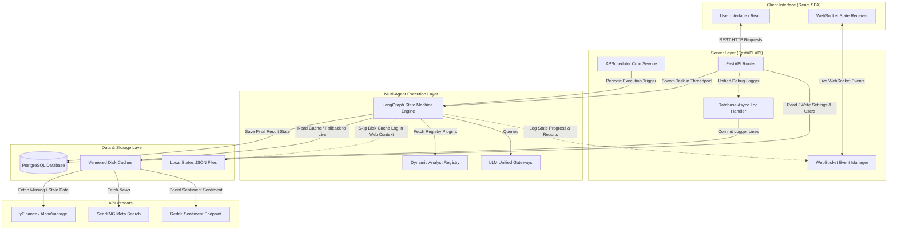

# System Architecture

TradingAgents uses a multi-layered design. This separation guarantees that user actions, background scheduled executions, and real-time state machines run concurrently without blocking the UI thread or API event loops.

---

## 1. High-Level Data Flow

The diagram below details the boundary limits and data flow directions among the React SPA client, the FastAPI API and WebSocket server, the LangGraph AI orchestrator, and external API providers.

---

## 2. Component Directory Boundaries

The source code is organized into three major system boundaries:

### A. The Backend Web Shell (`backend/`)
*   `api/`: Defines endpoints for user authentication, managing portfolios, watchlists, editing platform settings, querying logs, and manual analysis triggers.
*   `core/`: Core setup logic for SQLAlchemy connections, Fernet-based API key encryption/decryption, logging scrubbing/redaction to prevent keys from leaking into stdout/database, and the WebSocket registry (`ws_manager`).
*   `services/`: Business services (managing simulated trades, cron job assignments, sending alert/slack notifications, updating chart annotations, and spawning the graph wrapper).

### B. The AI Multi-Agent Core (`backend/trading_agents/`)
This is a self-contained AI module that imports itself as the `tradingagents` top-level namespace:
*   `agents/`: Outlines the prompt templates, system instructions, and schema formats for analysts (technical indicators, news, fundamentals, sentiment, options, macro, quantitative, review, earnings) and managers (research manager, portfolio manager, trader, and debate risk managers).
*   `graph/`: Houses the state machine architecture (`trading_graph.py`), graph conditional logic (`conditional_logic.py`), propagation configurations, and SQLite checkpoint database connectors.
*   `llm_clients/`: Handles the connections, token usage callback handlers, and specific provider thinking levels (reasoning effort metrics for OpenAI o1/o3, Gemini thinking, and Claude effort configurations).

### C. The Frontend Dashboard UI (`frontend/`)
*   A responsive dashboard built with React, TypeScript, and Vite.
*   `components/`: Visualizations for portfolio metrics, charting with trading annotations, live WebSocket state progressions, and log visualizers.
*   `pages/`: Interactive pages such as the Watchlist manager, Live multi-agent analysis visualizer, Mock Trading execution pane, and configuration dashboard settings.

---

## 3. Asynchronous Task Offloading Strategy

FastAPI's main thread runs on a single event loop. Executing heavy synchronous graph operations directly on this loop would cause API requests to timeout and disconnect active WebSockets.

To solve this, TradingAgents offloads executions:
1.  **Graph Invocation Thread Pool:** The function `async_propagate` runs the LangGraph runner `ta.graph.invoke` inside a separate thread pool using `asyncio.to_thread`.
2.  **Thread-safe WebSocket Signaling:** Within the spawned worker thread, callbacks are registered. These invoke `asyncio.run_coroutine_threadsafe` to push live state updates (like which agent node is executing) and partial reports back to the main event loop, which sends them over WebSockets to the frontend.
3.  **Background Database Workers:** Long-running database updates, such as parsing chart annotations and sending notifications via webhooks, are offloaded to background asyncio tasks (`asyncio.create_task`) to minimize initial response times.
