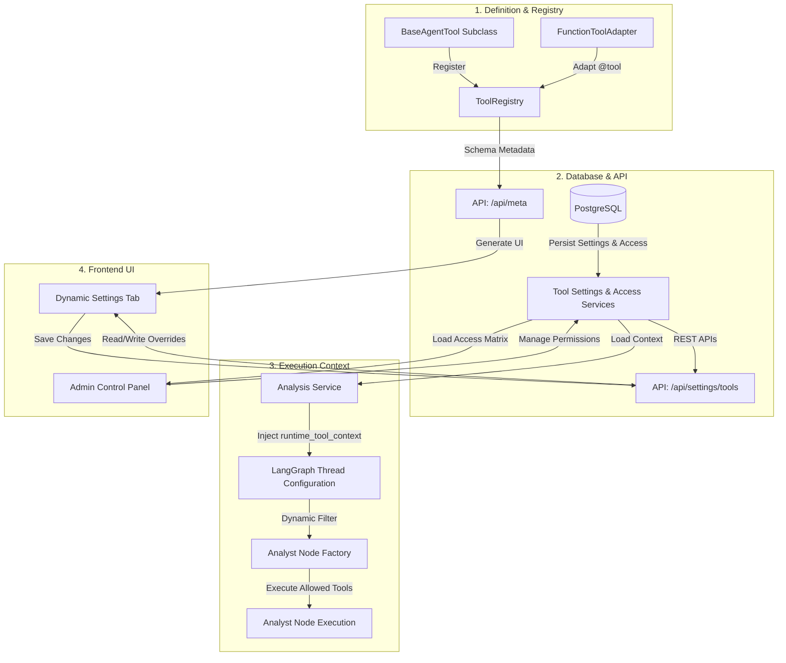

# 🛠️ Modular Agent Tool System

The Modular Agent Tool System is a dynamic, database-driven plugin architecture that decouples agent tools from hardcoded implementations. It allows administrators to globally control tool defaults, permits users to customize tool parameters, dynamically constructs settings panels on the frontend without hardcoded forms, and restricts execution capabilities using user-specific permissions.

---

## 🏗️ Architecture Overview

The system operates as a unified cycle linking definitions, persistence, execution, and client management:



---

## 🗄️ Database Schema & Permissions

All modular configurations are persisted in four SQLAlchemy tables declared under `backend/models/tool_settings.py`:

### 1. `agent_tool_settings`
Manages tool enablement status and field settings at both **user** and **server** scopes.
*   `scope`: Defines configuration level (`"user"` or `"server"`).
*   `user_id`: ForeignKey linking to the `users` table (null for server scope).
*   `tool_key`: Unique string identifier of the target tool (e.g. `"reddit_sentiment"`).
*   `enabled`: Nullable boolean indicating if the tool is active.
*   `settings_json`: Serialized JSON text containing parameter key-value overrides (e.g., `{"limit": 10}`).

### 2. `user_agent_access`
Restricts which of the 9 analyst nodes a specific user is authorized to trigger during portfolio/stock runs.
*   `user_id`: Link to the user.
*   `agent_key`: The analyst string key (e.g. `"market"`, `"sentiment"`).
*   `can_run`: Boolean access flag.

### 3. `user_tool_access`
A granular control matrix defining a user's rights to see or modify individual tools.
*   `can_view`: User is permitted to see this tool listed.
*   `can_use`: User is permitted to let agents execute this tool in runs.
*   `can_edit`: User is permitted to edit settings fields for this tool.
*   `can_enable`: User is permitted to toggle this tool on/off.

### 4. `user_tool_field_access`
Controls field-level visibility within a tool's parameters.
*   `field_key`: String key of the field.
*   `can_view` / `can_edit`: Visibility and edit permissions.

---

## 🔌 Tool Declaration & Adapters

Tools are declared as Python classes inheriting from `BaseAgentTool` (`backend/trading_agents/agents/tools/base.py`).

### 1. `BaseAgentTool` Properties
*   `key`: Unique string identifier (e.g. `"technical_indicators"`).
*   `category`: Category namespace (`"market"`, `"news"`, `"sentiment"`, etc.).
*   `default_enabled`: Initial fallback status.
*   `allowed_analysts`: Analysts allowed to bind this tool.
*   `settings_schema`: List of `ToolSettingField` objects representing parameters.

### 2. `ToolSettingField` Schema Elements
Each configuration parameter defines:
*   `key`: Name of the parameter.
*   `type`: Type mapping (`"boolean"`, `"number"`, `"string"`, `"textarea"`, `"select"`, `"multi_select"`, `"string_list"`, `"secret"`).
*   `scope`: Scope filter (`"user"`, `"server"`, or `"both"`).
*   `label_key` / `description_key`: I18n translations reference keys.
*   `default`: Default fallback value.
*   `min` / `max` / `step`: Bounds constraints (numbers).
*   `options`: Enumerated selects list options.

### 3. `FunctionToolAdapter`
To wrap existing LangChain `@tool` functions without rewriting them, the system uses `FunctionToolAdapter` inside `backend/trading_agents/agents/tools/adapters.py`. It accepts a Python function, extracts metadata, and maps settings dynamically.

---

## 🔄 Runtime Flow, Metadata Filtering & API Permission Checks

Since LangGraph runs asynchronously on thread pools, configuration values and permissions must be verified at API boundaries and injected dynamically into the execution state:

### 1. Dynamic Metadata Filtering (`/api/meta`)
The general metadata catalog `/api/meta` is user-aware:
*   **Analysts List Filtering:** Non-admin users only receive analysts in the `analysts` list if they have permission to run them (`can_run` is True or not explicitly False in `user_agent_access`). Unpermitted analysts are excluded, so they are automatically hidden on the frontend settings page.
*   **Tools List Filtering:** The `tools` list is filtered to only include tools that the user is authorized to see (`can_view` is True in `user_tool_access`).

### 2. API-Level Agent & Tool Permission Verification
*   **Settings Updates & Presets:** When a user updates their preferences via `PUT /api/settings` or applies a preset config, the backend filters the list of `selected_analysts` against the user's allowed agents, automatically removing any unauthorized entries.
*   **Tool Settings Access & Edits:**
    *   `GET /api/settings/tools` filters out tool settings the user does not have permission to view.
    *   `PUT /api/settings/tools` validates that the user is permitted to toggle the tool's status (`can_enable` must be True) and edit the tool's parameter fields (`can_edit` must be True). Any violations result in validation errors.

### 3. Context Construction & Execution
1.  **Context Construction:**
    In [analysis_service.py](../backend/services/analysis_service.py), when starting a run, the system queries settings and generates the thread context:
    ```python
    context = await build_global_runtime_context(db, user_id)
    ```
2.  **Graph Configuration:**
    The context dictionary is assigned to the LangGraph execution configuration:
    ```python
    config = {"configurable": {"runtime_tool_context": context}}
    ```
3.  **Active Tool Filtering:**
    Inside [trading_graph.py](../backend/trading_agents/graph/trading_graph.py), the `_filter_tools_for_analyst` utility checks `can_use` and enablement states, removing disabled tools.
4.  **Agent Bindings:**
    Inside [analyst_node_factory.py](../backend/trading_agents/agents/runtime/analyst_node_factory.py), the analyst node retrieves the configuration context and binds parameters before execution.

---

## 🎨 Frontend Dynamic Form Building

The frontend avoids hardcoding setting inputs. [ToolSettingsPanel.tsx](../frontend/src/components/settings/ToolSettingsPanel.tsx) maps schemas automatically:

*   **Boolean:** Renders as a custom slide switch.
*   **Number:** Renders as a dual slider-input widget using schema `min`, `max`, and `step` properties.
*   **Select:** Generates a dropdown select box utilizing localized i18n label values.
*   **String / Textarea / Secret:** Formats into text inputs, larger textareas, or masked password fields.
*   **String List:** Parses comma-separated values into a clean Javascript array.
*   **Localization (i18n):** All names, descriptions, and dropdown choices look up translated strings dynamically from [tools.ts](../frontend/src/i18n/tools.ts).

---

## 🛠️ Step-by-Step Developer Extension Guide

To add a new tool to the system:

### 1. Implement Tool Logic & Wrapper
Create a file `my_custom_tool.py` under `backend/trading_agents/agents/tools/builtin/`:
```python
from backend.trading_agents.agents.tools.base import BaseAgentTool, ToolSettingField, ToolContext
from backend.trading_agents.agents.tools.registry import registry

class MyCustomTool(BaseAgentTool):
    key = "my_custom_tool"
    category = "market"
    default_enabled = True
    allowed_analysts = ["market"]
    label_key = "tools.my_custom_tool.label"
    description_key = "tools.my_custom_tool.description"
    
    # Declare settings parameters schemas:
    settings_schema = [
        ToolSettingField(
            key="lookback_periods",
            type="number",
            scope="user",
            label_key="tools.my_custom_tool.lookback",
            default=14.0,
            min=5.0,
            max=50.0,
        )
    ]
    
    def get_langchain_tools(self, settings: dict, context: ToolContext) -> list:
        from langchain_core.tools import tool
        
        periods = int(settings.get("lookback_periods", 14))
        
        @tool
        def calculate_custom_lookback(symbol: str) -> str:
            """Calculate custom metric using lookback periods configuration."""
            return f"Custom metric calculated for {symbol} with periods={periods}"
            
        return [calculate_custom_lookback]

# Self-register
registry.register(MyCustomTool())
```

### 2. Bootload on Startup
Import your new class inside `backend/trading_agents/agents/tools/bootstrap.py` so it initializes on startup:
```python
from .builtin import my_custom_tool
```

### 3. Add Frontend Translations
Open [frontend/src/i18n/tools.ts](../frontend/src/i18n/tools.ts) and add values under English (`en`) and Turkish (`tr`) dictionaries:
```typescript
'tools.my_custom_tool.label': 'My Custom Tool',
'tools.my_custom_tool.description': 'Calculates lookback-based security metrics.',
'tools.my_custom_tool.lookback': 'Lookback Periods Limit',
```
Once saved and compiled, your new tool will automatically appear in:
*   The Settings tab of authorized users.
*   The Global default options in the Admin panel.
*   The User access matrices lists.
