# Multi-Agent Decision Core

The core value of TradingAgents lies in its decentralized multi-agent system. Instead of relying on a single prompt or agent, it splits the decision-making process into four distinct phases, organized via **LangGraph**.

---

## 1. The Five Execution Phases

```mermaid
stateDiagram-v2
    [*] --> Phase1_Analysts : Load Ticker & Date
    
    state Phase1_Analysts {
        [*] --> Fetch_Data : yFinance / API
        Fetch_Data --> Run_Plugins : Parallel Execution (with Chain-of-Thought)
        Run_Plugins --> Compile_Reports : Save State Dicts
    }
    
    Phase1_Analysts --> Phase1_Synthesis : Send Pre-Reports
    
    state Phase1_Synthesis {
        [*] --> Synthesis_Manager : Detect Alignments & Conflicts
    }

    Phase1_Synthesis --> Phase2_Debate : Send Synthesis Report
    
    state Phase2_Debate {
        [*] --> Bull_Thesis : Argue Bull (with Citations)
        Bull_Thesis --> Bear_Antithesis : Argue Bear (with Citations)
        Bear_Antithesis --> Check_Rounds : Max rounds reached?
        Check_Rounds --> Bull_Thesis : No
        Check_Rounds --> Auditor_Node : Yes
        Auditor_Node --> Research_Manager : Fact-Check Results
        Research_Manager --> Generate_Consensus : Write Judge Decision
    }
    
    Phase2_Debate --> Phase3_Plan : Send Thesis Consensus
    
    state Phase3_Plan {
        [*] --> Trader_Agent : Draft Execution Details
        Trader_Agent --> Formulate_Mock_Trade : Define Stop & Target
    }
    
    Phase3_Plan --> Phase4_Risk : Send Proposed Trade Plan
    
    state Phase4_Risk {
        [*] --> Aggressive_Debator : Argue Size & Wide Targets
        Aggressive_Debator --> Conservative_Debator : Argue Tight Safety Limits
        Conservative_Debator --> Neutral_Debator : Arbitrate Size Allocation
        Neutral_Debator --> Evaluate_Agreement : Consensus Reached?
        Evaluate_Agreement --> Aggressive_Debator : No (Loop)
        Evaluate_Agreement --> PM_Decision : Yes
    }
    
    Phase4_Risk --> [*] : Execute Orders & Save State
```



---

## 2. Phase 1: Analyst Plugins & Synthesis

Each active analyst node queries third-party libraries (e.g. `yFinance`, `AlphaVantage`, or web searches) and processes the raw data.
*   **Chain-of-Thought (CoT):** Analysts are now instructed to follow a multi-step reasoning process (Data Extraction -> Metric Evaluation -> Contextual Synthesis) before producing their report.
*   **Standardized Output:** All analyst reports follow a fixed structure: Executive Summary, Detailed Analysis, and a Data Table.
*   **Data-Hash Caching:** Every analyst (except `review`) uses SHA-256 data-hash caching. Before calling the LLM, the analyst fetches its input data, computes a hash of `(analyst_key, ticker, trade_date, data)`, and checks the `AnalystReportCache` table. If a cached report exists with the same hash, it is returned immediately without an LLM call — saving tokens and latency. The hash changes automatically when underlying data changes (news, prices, fundamentals), so stale cache is impossible.
*   **Synthesis Manager:** Before the debate begins, the Synthesis Manager reviews all analyst reports to identify **Alignments** (agreements) and **Conflicts** (contradictions). These conflicts set the primary agenda for the Bull vs. Bear debate.

---

## 3. Phase 2: The Investment Debate & Audit

To prevent confirmation bias and ensure factual accuracy, the system employs an adversarial debate and a final audit:
1.  **Bull Researcher (`bull_researcher.py`):** Acts as a high-conviction investor. It MUST cite specific metrics from the analyst reports and address the conflicts identified by the Synthesis Manager.
2.  **Bear Researcher (`bear_researcher.py`):** Acts as a short-seller. It highlights risks and dismantles bullish assumptions using specific evidence and citations.
3.  **The Debate Loop:** The state machine alternates between the Bull and Bear nodes for a configurable number of rounds.
4.  **Auditor Node (`auditor_node.py`):** A real-time fact-checker that reviews the debate transcript against the original analyst reports. It identifies hallucinations or unsupported claims before the final decision is made.
5.  **Research Manager (`research_manager.py`):** Acts as the judge. It reads the debate transcript AND the Auditor's report to produce a final consolidated thesis document.

---

## 4. Phase 3 & 4: Trade Formulation & The Risk Debate

Once the investment thesis is finalized, a trade plan is drafted and optimized:
1.  **The Trader (`trader.py`):** Receives the Research Manager's thesis and designs the trade plan, specifying the ticker, direction (Buy, Sell, Hold), entry range, target profit, and stop-loss levels.
2.  **The Risk Debate Loop:** The proposed trade plan is reviewed by three agents representing different risk tolerances:
    *   **Aggressive Debator (`aggressive_debator.py`):** Pushes for maximum sizing and wider stop-loss/take-profit ranges to capture volatility.
    *   **Conservative Debator (`conservative_debator.py`):** Prioritizes capital preservation, proposing smaller position sizes and tighter stop-losses.
    *   **Neutral Debator (`neutral_debator.py`):** Arbitrates the discussion to find a balanced position size and structure.
3.  **Portfolio Manager (`portfolio_manager.py`):** Resolves the risk debate, reviews the active portfolio's cash balance and risk limits, writes the final trade plan, and executes the simulated order.

---

## 5. Phase 5: Self-Correction (Deferred Reflection)

TradingAgents includes a feedback loop that evaluates past decisions using historical data:

```text
Run Ticker "AAPL" on Day N
   │
   ├── 1. Read AAPL's past decisions from Memory Log
   ├── 2. Are there pending decisions older than holding_days (e.g. 5 days)?
   │      └── Yes:
   │          ├── Query yFinance for AAPL's actual return over those 5 days
   │          ├── Compare returns against the benchmark index (SPY) to calculate Alpha
   │          ├── Spawns Reflector agent to evaluate the past decision's strengths/weaknesses
   │          └── Write results & reflection back to Memory Log
   │
   └── 3. Prepend reflections as "past_context" to the Portfolio Manager's current prompt
```

This ensures the Portfolio Manager is aware of past errors (e.g., setting a stop-loss too tight during high volatility, or ignoring macroeconomic indicators) when making new decisions for that asset.

---

## 6. Advanced Institutional Features

To provide professional-grade analysis, the system includes several advanced modules:

### SEC & Insider Intelligence
The **Fundamentals Analyst** leverages specialized tools (`get_sec_filings`, `get_insider_transactions_deep`) to monitor regulatory filings and management sentiment. High-volume insider buying is treated as a high-conviction bullish signal, while delayed filings or excessive selling trigger caution flags.

### Mathematical Risk Sizing (Kelly Criterion)
Moving beyond fixed percentages, the **Portfolio Manager** utilizes a mathematical risk engine based on the **Kelly Criterion**.
*   **Win Probability:** Derived from the Trader's confidence score.
*   **Risk/Reward:** Calculated from precise entry, stop-loss, and take-profit targets.
*   **Sizing Formula:** `K% = W - [(1 - W) / R]`, capped by user settings to ensure portfolio safety.

### Continuous Learning & Backtest Loop
The **Synthesis Manager** automatically runs historical backtests (`macd_crossover`, `rsi_oversold`) on the asset before the debate begins.
*   **Strict Learning:** If the **Strict Backtest Learning** setting is enabled, the Research Manager MUST justify any recommendation that contradicts poor historical performance (< 50% win rate).
*   **Hindsight Feedback:** Past failures identified by the Review Analyst are injected as hard constraints into the current analytical cycle.
