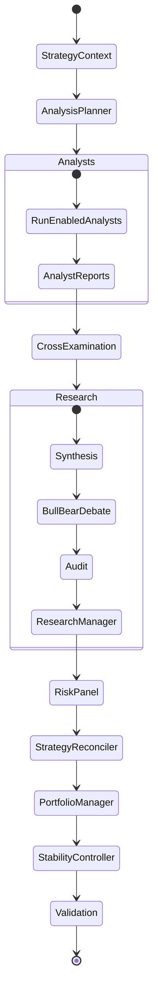

# Multi-Agent Decision Core

TradingAgents uses LangGraph to separate market evidence gathering, adversarial research, risk evaluation, and final portfolio intent. The architecture is deliberately structured so that no analyst or risk perspective can independently become an execution authority.

---

## 1. Execution Flow



`RiskPanel` is one graph node. It makes one LLM call and asks that call to return aggressive, conservative, and neutral perspectives in a structured transcript. Those perspectives are evidence inside the node; they are not independent LangGraph nodes.

The exact graph node names and conditional routing live in `backend/trading_agents/graph/`; this document describes the responsibility boundaries rather than duplicating every implementation detail.

---

## 2. Analyst Stage

The Market Intelligence portion of the graph executes the enabled analyst plugins. The current catalog contains 12 specialist roles:

1. Market / Technical
2. Social Sentiment
3. News
4. Fundamentals
5. Macroeconomics
6. Options Chain
7. Quantitative Factor
8. Earnings Call
9. Performance Review
10. Catalyst
11. Insider Activity
12. Institutional Ownership

Analysts gather data through the tool/dataflow layer and produce structured evidence for downstream stages. They are not permitted to own the final portfolio direction or execution quantity.

The active set of analysts is controlled by the agent catalog/hierarchy and user access/settings. Tool availability is resolved separately through the modular tool registry.

---

## 3. Synthesis, Cross-Examination, and Research Debate

After analyst evidence is available, the system resolves agreement and conflict before final risk evaluation.

The research layer can include:

- synthesis of analyst reports
- inter-agent/cross-examination context
- Bull/Bear thesis debate
- auditing/fact checking of claims against upstream evidence
- Research Manager consolidation

The purpose of this layer is to improve evidence quality and expose unsupported claims. Research agents do not bypass the Portfolio Manager proposal or the downstream stability controller.

---

## 4. Risk Debate

The risk stage is implemented by one Risk Debate node. One model invocation produces three named perspectives:

- aggressive
- conservative
- neutral

The panel surfaces evidence such as downside/invalidation scenarios, upside conditions, liquidity or concentration concerns, exposure and portfolio constraints, unresolved uncertainty, and risk/reward considerations.

These perspectives are **non-executable evidence**. They do not independently emit the final Buy/Sell/Hold action, final quantity, allocation, leverage, stop, target, or broker order.

This boundary is intentional: the risk panel influences the final proposal but does not compete for execution authority.

---

## 5. Strategy Reconciliation and Portfolio Manager

Before the Portfolio Manager, the Strategy Reconciler compares fresh structured
evidence with the exact active Asset Strategy. It proposes one of `KEEP`,
`STRENGTHEN`, `WEAKEN`, `INVALIDATE`, or `REBUILD`; it does not write to the
database or place an order. Persistence happens transactionally after the
graph run.

The Portfolio Manager is the sole AI stage that produces a raw structured
investment proposal.

It consumes the available upstream context, which may include:

- active analyst reports
- synthesis/cross-examination output
- Bull/Bear research transcript
- audit/research-manager result
- risk-panel evidence
- relevant portfolio state
- configured persona/settings
- available historical lessons/memory context

Its output can include the proposed rating, confidence, intended allocation/capital, entry, stop, target, and leverage fields supported by the current schema.

This is still **portfolio intent**, not an accepted decision or guaranteed
execution. The planner and analyst stage receive a neutral agenda derived from
prior assumptions and invalidations, not the previous Buy/Sell rating.

---

## 6. Decision Stability and Execution

The deterministic Decision Stability Controller follows the Portfolio Manager.
It compares the raw proposal with the prior **accepted** decision, run quality,
calibrated confidence, structured independent evidence, and triggered
invalidation conditions. Risk-increasing changes require more support than
risk-reducing changes; major cross-zero reversals additionally require explicit
invalidation and independent confirmation. A rejected reversal becomes Hold /
no new order rather than replaying the prior directional order.

`shadow` preserves the PM proposal for execution semantics and stores what enforcement would have done. `enforce` makes the controller's accepted decision canonical. A hard risk exit bypasses hysteresis and remains reduce-only in every mode.

See [`strategy_continuity.md`](strategy_continuity.md) for strategy versioning,
optimistic locking, replay safety, and the rollout scorecard.

---

## 7. Deterministic Execution Controls

Any optional trade created from an analysis must pass application-side controls outside the LLM decision itself.

Depending on the configured execution path, controls can include:

- available cash
- position/concentration limits
- gross exposure limits
- per-trade risk settings
- stop/risk validation
- broker/trading mode
- user/server execution settings

These controls can reduce, reject, or prevent the accepted canonical decision. Code that places orders consumes `portfolio_decision_json`, not intermediate analyst/risk text, chart annotations, or the raw PM proposal.

---

## 8. Reflection and Historical Learning

TradingAgents contains mechanisms for feeding historical outcomes and prior analysis context back into later runs. The exact behavior depends on enabled settings and configured memory components.

Do not assume that every run has external/vector memory enabled. Memory/provider configuration is user/runtime dependent, and the graph must continue to work when those optional integrations are unavailable.

Historical performance and review information is evidence for future decisions rather than a hardcoded substitute for current market data. Historical/time-travel replays load strategy state as-of both its effective and recorded time and do not mutate strategy or learning stores.

---

## 9. Analyst Report Caching

The runtime may cache analyst outputs when the relevant input-data identity matches a previous run. Caching is an optimization to reduce redundant model calls and latency; it is not a guarantee that external market data can never become stale.

When extending caching logic:

- include all material inputs in cache identity
- preserve user/tool configuration boundaries where they affect output
- avoid sharing user-sensitive context across users
- make invalidation behavior explicit

---

## 10. LLM Resolution

Agent LLM selection is resolved through the existing runtime hierarchy/settings rather than hardcoded per node.

Provider/model metadata comes from:

```text
backend/trading_agents/llm_clients/registry.py
```

and is exposed to the UI through:

```text
GET /api/settings/llm-catalog
```

Provider-specific reasoning controls belong in the LLM client/runtime layer.

---

## 11. Tool Resolution

Analyst tools use the modular registry under:

```text
backend/trading_agents/agents/tools/
```

Tool activation can depend on global defaults, user settings, analyst reachability, and access permissions. The resolved tool context is injected into a run before analyst execution.

See [`modular_tool_system.md`](modular_tool_system.md) for tool registration and permission details.

---

## 12. Real-Time Events

Analysis execution emits progress/report/debate events to the application event bus. In single-process mode they can be forwarded directly to connected WebSocket clients. With Redis enabled, the event bus can move those events across processes so the web process can stream work performed by an `arq` worker.

The analysis WebSocket endpoint is:

```text
/ws/analysis/{task_id}
```

JWT authentication must remain outside the URL and follow the existing WebSocket subprotocol design.

---

## 13. Source-of-Truth Rule

When this document conflicts with code, use the following implementation sources to resolve the mismatch:

- `backend/trading_agents/agent_catalog.py`
- `backend/trading_agents/agents/hierarchy.py`
- `backend/trading_agents/agents/analyst_registry.py`
- `backend/trading_agents/graph/`
- `backend/trading_agents/agents/tools/`
- `backend/trading_agents/llm_clients/registry.py`
- the final decision schema consumed by the application execution layer

Planned or retired agents, vendor integrations, or automated trading ideas should not be listed here as implemented features.
