# System Architecture

TradingAgents uses a multi-layered design. This separation guarantees that user actions, background scheduled executions, and real-time state machines run concurrently without blocking the UI thread or API event loops.

---

## 1. High-Level Data Flow

The diagram below details the boundary limits and data flow directions among the React SPA client, the FastAPI API and WebSocket server, the LangGraph AI orchestrator, and external API providers, highlighting the integration paths for advanced features.

```mermaid
graph TD
    subgraph Client ["Client Interface (React SPA)"]
        UI[User Interface / React]
        WS_Client[WebSocket State & Live Chat QnA]
        Chart_Viz[Interactive Charts & Live Debate Baloon UI]
        Dashboard_Full[Simulated Trading Dashboard]
    end

    subgraph Server ["Server Layer (FastAPI API)"]
        API_Route[FastAPI Router & Chat QnA Handler]
        Cron_Service[APScheduler Cron Service & Rebalancer]
        WS_Manager[WebSocket Event Manager]
        Attribution_Engine[Analyst Success Scorecard Service]
        AB_Testing_Service[LLM A/B Testing Service]
        DB_Log[Database Async Log Handler]
    end

    subgraph AI_Engine ["Multi-Agent Execution Layer"]
        LangGraph_Engine[LangGraph State Machine Engine]
        Registry[Dynamic Analyst Registry & Plugins]
        Debate_Flow[Live Bull/Bear & Risk Debate Stream]
        Persona_Manager[Investor Persona Context Filter]
        LLM_Gate[LLM Unified Gateways]
    end

    subgraph Persistence ["Data & Storage Layer"]
        DB[(PostgreSQL Database)]
        Cache_Dir[Veneered Disk Caches]
        FS_State[Local States JSON Files]
    end

    subgraph Vendors ["API Vendors"]
        Data_Providers[yFinance / AlphaVantage / SEC Form 4]
        Options_Sweeps[Options / Whale Sweeps Providers]
        Search_Providers[SearXNG Meta Search / Patents API / Supply Chain Map]
        Reddit_API[Reddit & Social Sentiment]
    end

    %% Flow lines
    UI <-->|REST HTTP Requests| API_Route
    WS_Client <-->|Live WebSocket Events & Debate / Chat QnA| WS_Manager
    
    API_Route -->|Read / Write Settings, Users, Scorecards & Presets| DB
    API_Route -->|Spawn Task in Threadpool / Chat Requests| LangGraph_Engine
    Cron_Service -->|Periodic Scan & Rebalancing Executions| LangGraph_Engine
    Attribution_Engine -->|Calculate Weights & Store Stats| DB
    AB_Testing_Service -->|Query Performance Metrics & Logs| DB
    
    LangGraph_Engine -->|Fetch Registry Plugins| Registry
    LangGraph_Engine -->|Queries| LLM_Gate
    LangGraph_Engine -->|Read Cache / Fallback to Live| Cache_Dir
    
    Cache_Dir -->|Fetch Missing / Stale Data / SEC Filings| Data_Providers
    Cache_Dir -->|Fetch News & Patents| Search_Providers
    Cache_Dir -->|Social Sentiment| Reddit_API
    Cache_Dir -->|Option Sweeps & Whale Trades| Options_Sweeps
    
    LangGraph_Engine -->|Save Final Result State & Debate Logs| DB
    LangGraph_Engine -.->|Log State Progress & Reports| WS_Manager
    LangGraph_Engine -.->|Skip Disk Cache Log in Web Context| FS_State
    
    API_Route -.->|Unified Debug Logger| DB_Log
    DB_Log -->|Commit Logger Lines| DB
```

---

## 2. Component Directory Boundaries

The source code is organized into three major system boundaries:

### A. The Backend Web Shell (`backend/`)
*   `api/`: Defines endpoints for user authentication, managing portfolios, watchlists, editing platform settings, querying logs, and manual analysis triggers. *Integrates A/B testing queries, QnA chat message routing, and scorecard lookups.*
*   `core/`: Core setup logic for SQLAlchemy connections, Fernet-based API key encryption/decryption, logging scrubbing/redaction to prevent keys from leaking into stdout/database, and the WebSocket registry (`ws_manager`).
*   `services/`: Business services (managing simulated trades, user-specific cron job assignments, sending alert/slack notifications, updating chart annotations, and spawning the graph wrapper). *Integrates the per-user watchlist scheduler and the Analyst Success Scorecard background tracking service.*

### B. The AI Multi-Agent Core (`backend/trading_agents/`)
This is a cohesive AI subsystem that lives inside the backend and is imported as the `backend.trading_agents` sub-package:
*   `agents/`: Outlines the prompt templates, system instructions, and schema formats for analysts (technical indicators, news, fundamentals, sentiment, options, macro, quantitative, review, earnings) and managers (research manager, portfolio manager, and debate risk managers). The Portfolio Manager is the sole executable decision authority. Organized into sub-agents under `sub/` (analysts, managers, researchers, risk_mgmt), execution runtime helpers under `runtime/`, tool data handlers under `data/`, and general utilities under `utils/`. *Features specialized modules for Investor Personas, Patent & Research evaluation, Short Squeeze analysis, and Supply Chain risk mappings.*
*   `graph/`: Houses the state machine architecture (`trading_graph.py`), graph conditional logic (`conditional_logic.py`), propagation configurations, and SQLite checkpoint database connectors. *Streams intermediate debate dialogs directly to the WebSocket and incorporates dynamic performance weightings for each analyst.*
*   `llm_clients/`: Handles the connections, token usage callback handlers, and specific provider thinking levels (OpenAI reasoning effort, Gemini thinking budget, and Claude effort configurations). Per-provider model lists live in `llm_clients/model_catalog.py` and are served via `/api/settings/llm-catalog`.

### C. The Frontend Dashboard UI (`frontend/`)
*   A responsive dashboard built with React, TypeScript, and Vite.
*   `components/`: Visualizations for portfolio metrics, charting with trading annotations, live WebSocket state progressions, and log visualizers. *Features the chat QnA widget, live bubble debate visualizer, A/B Testing charts, and interactive Recharts graphs.*
*   `pages/`: Interactive pages such as the Watchlist manager, Live multi-agent analysis visualizer, Mock Trading execution pane, and configuration dashboard settings.

---

## 3. Asynchronous Task Offloading Strategy

FastAPI's main thread runs on a single event loop. Executing heavy graph operations directly on this loop without yielding would block other requests.

To solve this, TradingAgents utilizes a fully asynchronous architecture:
1.  **Asynchronous Graph Execution:** The function `async_propagate` runs the LangGraph runner using `await ta.graph.ainvoke` or `ta.graph.astream`. This allows the event loop to yield during LLM calls or tool executions, keeping the server responsive.
2.  **Async/Sync Bridging (where needed):** While most components are now native async, any remaining heavy synchronous calculations (like pandas-based backtests or yfinance fetches) are offloaded to threads using `asyncio.to_thread` from within their respective async tools or nodes.
3.  **Real-time WebSocket Streaming:** The graph uses `astream` to push live state updates (like which agent node is executing) and partial reports directly to the main event loop, which multicasts them over WebSockets to the frontend.
4.  **Background Database Workers:** Long-running database updates, such as parsing chart annotations and sending notifications via webhooks, are offloaded to background asyncio tasks (`asyncio.create_task`) to minimize initial response times.
5.  **Optional Out-of-Process Analysis Worker:** With `REDIS_URL` set and `ANALYSIS_QUEUE_MODE=worker`, analysis runs are enqueued onto **arq** and executed by a separate `backend.worker` process; WebSocket events flow back to web clients over Redis pub/sub, and the task registry/cancel requests are shared across processes (`core/event_bus.py`, `core/task_store.py`).

---

## 4. Architectural Integration Blueprint for Advanced Features

This section outlines how the 16 new AI, visual, and automated execution features map onto the existing system architecture.

### A. AI & Multi-Agent Layer
*   **Interactive Q&A on Reports (1):** Integrates as an asynchronous chat endpoint `/api/analysis/{analysis_id}/chat` which starts a separate lightweight agent context initialized with the completed analysis report content as system context.
*   **Live Analyst Debate (2):** The `BullResearcher` and `BearResearcher` nodes are upgraded to emit message structures containing raw debate transcripts over the active WebSocket channel during their execution.
*   **Analyst Success Scorecard (3):** A daily/weekly cron service measures the predictive success of each analyst (e.g. Signal vs Price action delta at T+7 and T+30 days). The calculated weights are stored in PostgreSQL and read dynamically by the `Portfolio Manager` node to weight analyst inputs.
*   **Investor Personas (4):** The user's active risk profile/persona (`conservative`, `aggressive`, `esg`) is loaded from the settings database and passed as metadata context into the system prompts of all debate and management agents.
*   **LLM A/B Testing Panel (5):** An analytics router compiles execution metrics (duration, token costs, win rates) across different setting templates (presets) for performance comparisons.

### B. Visualizations & Dashboards Layer
*   **Interactive Charts (6):** The frontend integrates Recharts components and TradingView Lightweight Charts, displaying candle series, volume, and overlaying support/resistance levels, target price lines, and stop losses. Now features a **Dynamic Custom Formula Box** evaluated securely on the backend, **Agent-to-UI Visual Annotations** (Buy/Sell arrows, custom text markers, and trendlines), and dynamically loaded custom indicator subcharts.
*   **Trading Dashboard (7):** Integrates live data feeds with transaction logs, open orders, and P&L tracking (using real-time price updates).

### C. Advanced Data Scanning & Signals Layer
*   **Vision-Based Pattern Recognition:** Serves candlestick chart plots (last 90 days) through `mplfinance`, converts them into base64 images, and prompts the vision LLM to extract visual shapes (Head & Shoulders, Flags, etc.), appending these findings to technical reports.
*   **Multi-Timeframe Trend Alignment:** Downloads Weekly/Monthly macro data, computes a 20 EMA, and performs a backward merge mapping it onto daily candlesticks as a trend overlay.
*   **SEC Insider Tracking (8):** A background service queries external SEC Form 4 feeds and appends executive and political trades to the `NewsAnalyst` or `FundamentalsAnalyst` context.
*   **Patent & R&D Scanning (9):** A dedicated tool queries research and patent databases to score corporate innovation pipelines for the `FundamentalsAnalyst` or a new `R&D Analyst`.
*   **Whale & Option Sweeps (10):** An options data worker tracks large-block option flows and pushes sweep alerts directly to the `OptionsAnalyst` node.
*   **Algorithmic Triggers (11):** A technical scanner runs in the background. If a configured break-out condition is met (e.g. MACD crossovers), it invokes a background LangGraph run automatically.
*   **Short Squeeze Potential (12):** Integrates short interest, share borrow rates, and social mentions metrics into a dedicated `SqueezeAnalyst` subclass evaluation.

### D. Supply Chain & Risk Management Layer
*   **Supply Chain Mapping (13):** A database mapping dependencies (TSMC -> Apple) enables the `MacroAnalyst` to construct stress-test simulations for geopolitics or disasters.
*   **Activist Investor Alerts (14):** Scans Form 13D filings and activist headlines to inject proxy battle risk matrices into the `ReviewAnalyst`.

### E. Automation & Portfolio Management Layer
*   **Auto-Rebalancing (15):** A cron schedule triggers portfolio rebalancing by calculating differences between target and actual allocations, sending buy/sell orders via the simulated or integrated broker.
*   **Fractional Shares Optimization (16):** The order management and simulation broker engines are updated to accept floating-point order sizes (e.g. `0.025` shares) to support small capital diversification targets.
