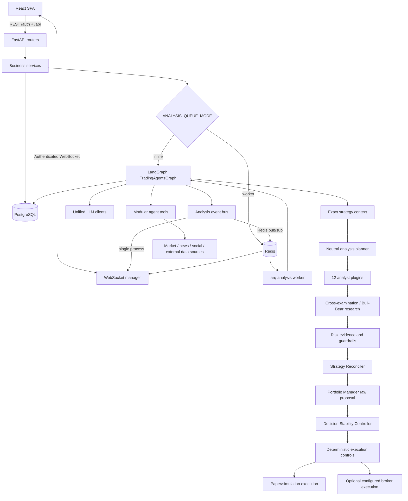

# System Architecture

TradingAgents is split into a React frontend, a FastAPI application shell, a LangGraph-based multi-agent decision engine, PostgreSQL persistence, and optional Redis/arq worker infrastructure. This document describes the current implementation rather than proposed or roadmap-only features.

---

## 1. High-Level Runtime Flow



The important ownership boundary is that agent output is not itself an order. The Portfolio Manager produces a raw structured proposal; the Decision Stability Controller records or accepts the canonical decision, and application-side risk, cash, exposure, broker, and execution controls still decide whether an order can be placed.

---

## 2. Repository Boundaries

### `backend/api/` — HTTP presentation layer

FastAPI routers validate input, enforce authentication/authorization, call services, and return DTOs. Business logic belongs outside the routers.

Major route groups cover authentication, analyses, market data, watchlists, portfolio/trading, settings, users/RBAC, logs, alerts, cron jobs, metadata, updates, reports, screeners, and other dashboard features.

The authentication router is mounted under `/auth`; most application APIs are mounted under `/api`.

### `backend/services/` — application/business logic

Services coordinate database access, market-data work, analysis runs, report chat, paper trading, order execution, alerts, scheduling, performance calculations, notifications, update operations, and related workflows.

Long-running synchronous vendor or numerical work should not block the FastAPI event loop. Existing synchronous operations are bridged from async code using appropriate worker/thread boundaries.

### `backend/repositories/` — data access helpers

Repositories and shared query helpers encapsulate repeated database access and per-user scoping. User-owned records must preserve ownership checks to avoid cross-user data exposure.

### `backend/models/` and `backend/schemas/`

- `models/` contains SQLAlchemy ORM persistence models.
- `schemas/` contains Pydantic request/response contracts.

PostgreSQL through SQLAlchemy async/`asyncpg` is the supported primary database path.

### `backend/core/` — platform infrastructure

Core modules include:

- application configuration
- async database engine/session setup
- security, JWT, password hashing, and Fernet encryption
- request limits and proxy handling
- logging/redaction
- WebSocket connection management
- Redis event transport
- cross-process task registry/cancellation
- startup schema migration helpers

The default single-process path works without Redis. Redis becomes important when work is split across processes.

---

## 3. Multi-Agent Decision Engine

The AI subsystem lives under `backend/trading_agents/` and is imported by the FastAPI application as an internal package.

### Current decision stages

The implementation separates specialized evidence production from final execution authority:

1. **Strategy Context + Analysis Planner** — loads the exact active/as-of strategy and creates a neutral investigation agenda without exposing its old direction to fresh analysts.
2. **Market Intelligence / analyst execution** — runs the enabled analyst plugins.
3. **Cross-examination and research synthesis** — resolves conflicts and runs Bull/Bear thesis work and auditing/management steps, including structured synthesis evidence.
4. **Risk evaluation** — aggressive, conservative, and neutral risk agents produce risk evidence and guardrails.
5. **Strategy Reconciler** — compares new evidence with the active thesis and proposes `KEEP`, `STRENGTHEN`, `WEAKEN`, `INVALIDATE`, or `REBUILD`.
6. **Portfolio Manager** — emits the sole AI raw structured proposal.
7. **Decision Stability Controller** — records (shadow) or accepts (enforce) the canonical decision using hysteresis, invalidations, independent evidence, quality, and calibrated confidence.
8. **Transactional persistence and application execution controls** — atomically records the accepted result/strategy version; application controls may still reject, reduce, or prevent an order.

The current analyst catalog contains 12 specialized analyst plugins: Market/Technical, Social Sentiment, News, Fundamentals, Macroeconomics, Options Chain, Quantitative Factor, Earnings Call, Performance Review, Catalyst, Insider Activity, and Institutional Ownership.

Risk agents do **not** independently own final Buy/Sell/Hold direction or executable quantity/allocation. The Portfolio Manager is the sole AI proposal authority; the deterministic controller owns the canonical accepted-decision boundary.

### Package layout

```text
backend/trading_agents/
├── agent_catalog.py
├── personas.py
├── agents/
│   ├── analyst_registry.py
│   ├── hierarchy.py
│   ├── main/
│   ├── sub/
│   │   ├── analysts/
│   │   ├── researchers/
│   │   ├── managers/
│   │   └── risk_mgmt/
│   ├── runtime/
│   └── tools/
├── graph/
├── dataflows/
└── llm_clients/
```

For the detailed graph and agent responsibilities, see [`multi_agent_system.md`](multi_agent_system.md), [`strategy_continuity.md`](strategy_continuity.md), and [`../../backend/trading_agents/README.md`](../../backend/trading_agents/README.md).

---

## 4. Modular Tool System

Agent tools are registered through the tool registry under `backend/trading_agents/agents/tools/`.

Each tool can expose:

- a stable tool key and category
- target/allowed analysts
- default enabled state
- configurable settings schema
- LangChain-compatible executable functions

Tool metadata is exposed to the frontend so settings controls can be generated from backend metadata rather than duplicated manually in React.

Access control supports system defaults and user-specific permissions/overrides. Runtime settings are resolved and injected into the analysis context before graph execution.

See [`modular_tool_system.md`](modular_tool_system.md) for the extension model.

---

## 5. LLM Provider Layer

The unified provider implementation lives under:

```text
backend/trading_agents/llm_clients/
```

The authoritative provider/model registry is:

```text
backend/trading_agents/llm_clients/registry.py
```

The UI receives the current catalog through:

```text
GET /api/settings/llm-catalog
```

Registered provider support includes OpenAI, Anthropic Claude, Google Gemini, and NVIDIA NIM/OpenAI-compatible models. Provider-specific reasoning controls are mapped from runtime settings by the LLM client layer.

Provider API keys are stored encrypted in PostgreSQL through application settings. They are not normal backend `.env` configuration.

---

## 6. Analysis Execution Modes

### Inline mode

```ini
ANALYSIS_QUEUE_MODE=inline
REDIS_URL=
```

Analyses execute inside the FastAPI process. WebSocket events can be delivered directly to in-process clients. This is the default lightweight deployment model.

### Worker mode

```ini
REDIS_URL=redis://localhost:6379/0
ANALYSIS_QUEUE_MODE=worker
```

Analysis requests are queued to `arq` and executed by `backend.worker.WorkerSettings` in a separate worker process.

In this mode Redis is used for more than queueing: it also carries cross-process analysis events and supports shared task ownership/cancellation so a FastAPI process can serve WebSocket clients while a different process performs the analysis.

Docker Compose enables this worker architecture by default.

---

## 7. WebSocket Event Flow

Long-running analyses stream progress over:

```text
/ws/analysis/{task_id}
```

The current authentication design does not put the JWT in the URL. Clients offer a private JWT-bearing WebSocket subprotocol together with `tradingagents.v1`; the server selects the application protocol while validating the token separately.

In single-process mode the event bus can forward events directly to the WebSocket manager. With Redis enabled, events can cross process boundaries using Redis pub/sub.

---

## 8. Persistence and Schema Management

PostgreSQL stores application users, settings, encrypted provider credentials, analyses, portfolio/trading state, logs, alerts, and other feature data.

On startup the backend creates missing tables and supports additive idempotent column migration for databases that have not been placed under Alembic management. Once an Alembic baseline/version is present, startup migration logic defers to Alembic for that database.

Destructive schema changes such as drops, renames, and incompatible type changes require an explicit migration strategy.

---

## 9. Frontend Architecture

The frontend is a React 19 + TypeScript application built with Vite and Tailwind CSS.

Development mode uses the Vite server and proxies `/api`, `/auth`, and `/ws` to FastAPI. Production Linux builds are emitted to `frontend/dist` and can be served by FastAPI. The Docker deployment instead uses the frontend container as the public nginx-served application/reverse-proxy entry point.

The frontend includes dashboard, analysis, charts, watchlists, portfolio/trading, orders, alerts, performance, A/B testing, administration, logs, settings, screener, sector rotation, reports, and related feature pages.

---

## 10. Deployment Topologies

### Linux/systemd

`deploy/install.sh` provisions PostgreSQL, the virtual environment, frontend build, root `.env`, and a managed systemd web service. The optional Redis/arq worker can be enabled separately.

### Docker Compose

The current compose stack contains:

- PostgreSQL
- Redis
- FastAPI backend
- arq worker
- frontend/nginx
- Prometheus
- Grafana
- postgres-exporter
- redis-exporter

The backend and monitoring ports are bound to loopback by default where appropriate. Public application traffic is expected to enter through the frontend proxy.

---

## 11. What Is Not Part of This Architecture Contract

Older versions of this document mixed implemented functionality with proposed ideas such as dedicated `SqueezeAnalyst` classes, patent/R&D scanners, supply-chain maps, and whale-sweep subsystems. Those items must not be treated as implemented architecture unless corresponding production code exists in the repository.

Roadmap ideas should be documented separately from this file. This document is intended to remain a description of code that exists in the current branch.
