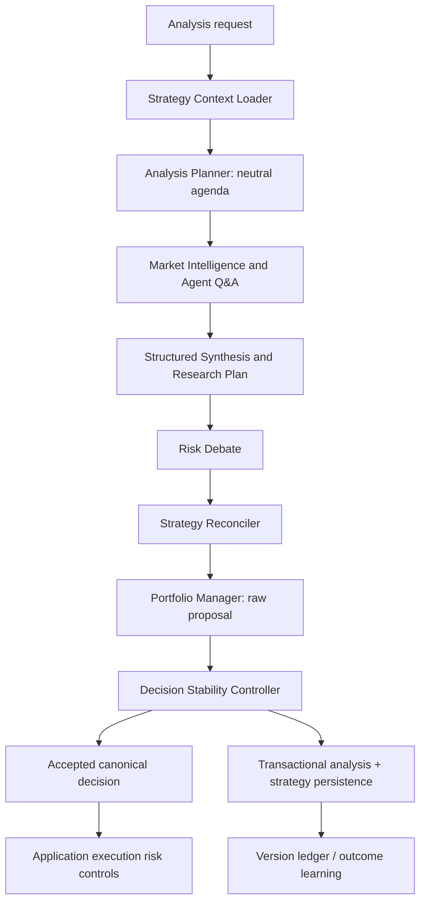

# Asset Strategy Continuity & Decision Stability

TradingAgents keeps two different kinds of history:

- **episodic memory** answers “what happened in similar situations?”;
- an **Asset Strategy** answers “what is the system's current, exact belief for this owner and instrument?”

The second is a durable PostgreSQL record, not a vector-memory document. It
lets a later analysis test an existing thesis without telling fresh analysts
which rating the system previously preferred. This page documents the
implemented strategy-continuity boundary and its rollout controls. It does not
claim that continuity improves return, alpha, or execution quality by itself.

---

## 1. Decision flow and ownership



The graph has no database session. It proposes state changes; the analysis
orchestrator is the single persistence boundary after the run completes. The
application's execution controls remain authoritative for cash, concentration,
gross exposure, correlation, broker, and order-risk rules.

| Contract | Purpose | May contain a directional rating? | Lifetime |
| --- | --- | --- | --- |
| `AnalysisPlan` | Neutral questions, prior assumptions to retest, data gaps, and analyst assignments | No | One run |
| `investment_plan` / Research Plan | Research Manager's current synthesis, evidence, and risk conditions | Yes, as research bias | One run / result record |
| `AssetStrategy` | Current exact thesis, conviction, drivers, watch/invalidation conditions, regime assumption, and accepted rating | Yes | Persistent per user + ticker + asset type |
| Episodic/vector memory | Similar past outcomes, alpha, reflection, and lessons | Indirectly | Persistent recall corpus |
| `PMDecisionProposal` | Portfolio Manager's raw, non-executable proposal | Yes | One run / result record |
| `AcceptedDecision` | Controller's canonical decision and tactical/execution action | Yes | One run / execution input |

The Strategy Context Loader deliberately exposes a **blind planning context**
to the Analysis Planner: drivers, open questions, watch conditions, and
invalidation conditions are visible; prior rating, strategic bias, and
conviction are not. Analysts therefore receive questions such as “retest the
margin assumption,” not “confirm the old Buy.” Review/hindsight evidence is
never counted as an independent confirmation for a major reversal.

---

## 2. Persistent state and audit trail

`asset_strategies` holds the current state. At most one `ACTIVE` row is allowed
for each `(user_id, ticker, asset_type)` (including system-owned rows). Its
main fields are:

- lifecycle and optimistic-lock `version`;
- `strategic_bias`, `conviction`, `accepted_rating`, thesis, horizon;
- drivers, watch conditions, invalidation conditions, open questions, and
  structured regime assumption;
- provenance (`last_analysis_id`) and effective/recorded/review timestamps.

`asset_strategy_versions` is an append-only ledger. Each revision preserves
before/after snapshots, revision action, evidence and invalidations, regime
before/after, proposed and accepted ratings, change strength, analysis
provenance, and bitemporal timestamps. ORM updates to ledger rows are rejected.

`AnalysisResult` stores the run-level evidence needed to explain a decision:
the analysis plan, structured synthesis and regime, strategy before/after and
candidate, raw PM proposal, accepted canonical decision, transition,
calibrated confidence, persistence status, and analysis/learning mode.

### Revision semantics

| Reconciler action | Durable effect |
| --- | --- |
| `CREATE` | Create the first active strategy and ledger entry. |
| `KEEP` | Preserve the version; update `last_reviewed_at` only. |
| `STRENGTHEN` / `WEAKEN` | Material revision with a new ledger version. |
| `INVALIDATE` | Preserve the prior lineage for audit and mark its current state invalidated. |
| `REBUILD` | Close the old lineage and create a fresh active lineage in one transaction. |

Only material changes should create a new version. This keeps a long sequence
of routine reviews from becoming synthetic thesis churn.

When a thesis has already been invalidated, the next live run loads that
non-active record only as a predecessor for neutral planning and reconciliation.
It is never treated as the active thesis or shown to analysts with its prior
rating. A replacement is therefore recorded as `REBUILD`, preserving the
causal lineage instead of silently creating an unrelated v1 strategy.

### Concurrent analyses

Strategy changes use optimistic locking (`expected_version`). If two runs read
v5, only one may apply v5 → v6. The stale run remains a completed analysis,
but its physical canonical decision is converted to `Hold` / no new order and
its transition records a strategy conflict. It is not silently retried against
the newer thesis.

---

## 3. Stability controller

The Portfolio Manager produces a raw proposal. The deterministic controller
compares it with the **last accepted** decision, not merely the last PM
proposal. Ratings have ordered scores:

```text
Sell -2 | Underweight -1 | Hold 0 | Overweight +1 | Buy +2
```

Thresholds are asymmetric: increasing risk needs more evidence than reducing
risk. A cross-zero reversal needs explicit triggered invalidation(s), at least
two independent supporting evidence groups, high run quality, and calibrated
confidence. The optional narrow Reversal Verifier may approve, reject, or mark
such a reversal insufficient; it does not make a new investment decision.

There are three deliberately distinct outputs:

| Layer | Example when a Sell reversal is rejected |
| --- | --- |
| Strategic state | `BULLISH_WEAKENING` |
| Tactical action | `HOLD` |
| Execution action | `NO_NEW_ORDER` |

A rejected reversal never replays the previous Buy as a new order. A hard
risk exit bypasses hysteresis and is always reduce-only. A controller failure
also fails closed to a no-new-order Hold.

### Modes

`decision_stability_mode` has three values:

- `off` — records the normal proposal path without controller enforcement;
- `shadow` (default) — preserves the PM proposal as the canonical execution
  input while storing the controller's counterfactual transition;
- `enforce` — persists the controller's accepted decision as the canonical
  execution input. Hard-risk exits are enforced in every mode.

`portfolio_decision_json` is the canonical field consumed by downstream
execution. `pm_proposal_json` is retained for explanation and comparison.

---

## 4. Historical and time-travel safety

The strategy ledger is bitemporal:

- `effective_at` is the business time a belief represents;
- `recorded_at` is when the system learned it.

A historical or time-travel run loads only a version whose effective **and**
recorded times are no later than the requested analysis time. A 2026 strategy
cannot appear in a 2025 replay. These runs set `learning_eligible = false`, so
they do not mutate active strategies, vector memory, analyst-performance
learning, signal backtests, or return attribution. The same isolation is used
for current/outcome context that would otherwise leak future knowledge.

Checkpoint time-travel additionally overwrites any saved live
`strategy_context`, `past_context`, `analysis_mode`, and learning flag before
the graph resumes. A selected checkpoint can therefore retain its intended
research state without carrying a later live attribution snapshot or
permission to write learning artifacts.

Live strategy learning can additionally be disabled with
`strategy_learning_enabled`; the analysis remains available, but no strategy
revision is written.

---

## 5. Configuration and operations

The following user/application settings are injected into the run configuration:

| Setting | Default | Meaning |
| --- | --- | --- |
| `strategy_learning_enabled` | `true` | Allows live runs to update exact strategy state. |
| `decision_stability_mode` | `shadow` | Rollout mode: `off`, `shadow`, or `enforce`. |
| `decision_stability_min_quality` | `70` | Minimum run-quality gate used by the controller. |
| `decision_stability_min_confidence` | `0.65` | Minimum controller confidence gate. |
| `decision_stability_min_evidence_groups` | `2` | Independent-group requirement for major reversals. |
| `reversal_verifier_enabled` | `true` | Enables the narrow verifier on qualifying major reversals. |
| `confidence_calibration_enabled` | `false` | Enables historical confidence calibration before controller gating. |
| `regime_aware_weighting_enabled` | `false` | Uses Bayesian-shrunk global, ticker, matching-regime, and recent analyst accuracy as a PM evidence-quality prior. |

Run the Alembic migrations before enabling the feature on an existing
PostgreSQL deployment. The strategy endpoints are tenant-scoped:

```text
GET /api/analysis/strategies/{ticker}
GET /api/analysis/strategies/{ticker}/history
```

The analysis UI shows the strategy transition and persistence status alongside
raw/accepted decision data. Treat a missing strategy as a normal first-analysis
condition, not an error in the agent graph.

Operational safeguards:

- Keep the controller in shadow mode until counterfactual results have enough
  representative live and replay samples.
- Do not infer realized performance from the same run that generated a
  proposal; wait for the configured outcome/attribution path.
- Investigate `strategy_update_status=conflict` rather than overriding it;
  it intentionally prevents stale thesis changes and orders.
- Preserve user/ticker/asset-type scoping in every new strategy query or API.
- Treat the strategy ledger as audit evidence, not as a substitute for broker
  or deterministic risk controls.

---

## 6. Rollout scorecard

Shadow mode should record both the PM proposal and what enforcement would have
done. Review the scorecard by ticker, regime, risk direction, and sample size:

| Metric | Question it answers |
| --- | --- |
| Decision flip rate | Are ratings changing less often without merely freezing? |
| Whipsaw rate | Does a change reverse again shortly afterwards? |
| Major reversal precision | Were approved cross-zero reversals subsequently supported by outcome data? |
| Blocked-change performance | What happened to proposals the controller would have blocked? |
| Reaction delay | How quickly did valid trend/invalidation changes reach the accepted decision? |
| Strategy revision rate | Are durable thesis versions changing only when material? |
| Brier score / calibration curve | Does stated confidence match observed outcomes? |
| Alpha and max drawdown | Did the combined policy improve return quality without hiding risk? |

Do not promote `shadow` to `enforce` solely because flip rate falls. The
promotion decision must weigh whipsaw reduction against reaction delay,
drawdown, and adverse cases where a conservative hold delayed a necessary exit.

---

## 7. Implementation map

The source of truth is the code. Key entry points are:

```text
backend/models/asset_strategy.py
backend/repositories/asset_strategy.py
backend/services/strategy_context_service.py
backend/services/strategy_persistence_service.py
backend/services/decision_stability_service.py
backend/services/confidence_calibration_service.py
backend/trading_agents/agents/main/analysis_planner.py
backend/trading_agents/agents/main/strategy_reconciler.py
backend/trading_agents/agents/main/decision_stability.py
backend/trading_agents/graph/setup.py
backend/services/analysis/orchestrator.py
```

For the surrounding graph and execution ownership boundaries, see
[`multi_agent_system.md`](multi_agent_system.md) and
[`overview.md`](overview.md).
