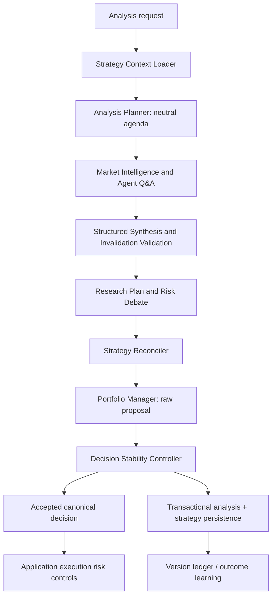

# Asset Strategy Continuity & Decision Stability

TradingAgents keeps two different kinds of history:

- **episodic memory** answers “what happened in similar situations?”;
- an **Asset Strategy** answers “what is the system's current, exact belief for this owner and instrument?”

The second is a durable PostgreSQL record, not a vector-memory document. It
lets a later analysis test an existing thesis without telling fresh analysts
which rating the system previously preferred. This page documents the
implemented strategy-continuity boundary and its rollout controls. It does not
claim that continuity improves return, alpha, or execution quality by itself.

---

## 1. Decision flow and ownership



The graph has no database session. It proposes state changes; the analysis
orchestrator is the single persistence boundary after the run completes. The
application's execution controls remain authoritative for cash, concentration,
gross exposure, correlation, broker, stop/drawdown rules, and order-risk rules.

| Contract | Purpose | May contain a directional rating? | Lifetime |
| --- | --- | --- | --- |
| `AnalysisPlan` | Neutral questions, prior assumptions to retest, exact invalidations to check, data gaps, and analyst assignments | No | One run |
| Structured synthesis | Source-aware evidence, regime, conflicts, and only validated plan-listed invalidation events | No executable order | One run |
| `investment_plan` / Research Plan | Research Manager's current synthesis, evidence, and risk conditions | Yes, as research bias | One run / result record |
| `AssetStrategy` | Current exact thesis, conviction, drivers, watch/invalidation conditions, regime assumption, and accepted rating at the durable revision boundary | Yes | Persistent per user + ticker + asset type |
| Episodic/vector memory | Similar past outcomes, alpha, reflection, and lessons | Indirectly | Persistent recall corpus |
| `PMDecisionProposal` | Portfolio Manager's raw, non-executable proposal | Yes | One run / result record |
| `AcceptedDecision` | Controller's canonical decision and tactical/execution action | Yes | One run / execution input |

The Strategy Context Loader deliberately exposes a **blind planning context**
to the Analysis Planner: drivers, open questions, watch conditions, and
invalidation conditions are visible; prior rating, strategic bias, and
conviction are not. Analysts therefore receive questions such as “retest the
margin assumption,” not “confirm the old Buy.” Review/hindsight evidence is
never counted as an independent confirmation for a major reversal.

### Invalidation trust boundary

An invalidation is not free-form LLM text. The neutral `AnalysisPlan` defines
the allowed condition IDs and severities before fresh research starts.
Synthesis may report that one of those conditions fired, but the result is
sanitized deterministically before it reaches strategy or execution logic:

- the `condition_id` must exist in the current plan;
- severity is taken from the plan, not from synthesis output;
- cited evidence IDs must exist and explicitly link themselves to that
  invalidation condition;
- a critical invalidation needs at least two independent non-review evidence
  groups;
- unknown/unlinked events are discarded rather than promoted to risk state.

`WATCH` is an observation/caution state and cannot close an active strategy.
Only validated `MATERIAL` or `CRITICAL` invalidations may support
`INVALIDATE`.

---

## 2. Persistent state and audit trail

`asset_strategies` holds the current state. At most one `ACTIVE` row is allowed
for each `(user_id, ticker, asset_type)` (including system-owned rows). Its
main fields are:

- lifecycle and optimistic-lock `version`;
- `strategic_bias`, `conviction`, `accepted_rating`, thesis, horizon;
- drivers, watch conditions, invalidation conditions, open questions, and
  structured regime assumption;
- provenance (`last_analysis_id`) and effective/recorded/review timestamps.

`accepted_rating` is bound at the post-controller persistence boundary. The
Strategy Reconciler does not own tactical ratings. A material strategy
revision therefore records the physically canonical accepted rating without
allowing an LLM lifecycle candidate to overwrite it.

`asset_strategy_versions` is an append-only ledger. Each revision preserves
before/after snapshots, revision action, evidence and invalidations, regime
before/after, proposed and accepted ratings, change strength, analysis
provenance, and bitemporal timestamps. ORM updates to ledger rows are rejected.

`AnalysisResult` stores the run-level evidence needed to explain a decision:
the analysis plan, structured synthesis and regime, strategy before/after and
candidate, raw PM proposal, accepted canonical decision, transition,
calibrated confidence, persistence status, and analysis/learning mode.

### Revision semantics

| Reconciler action | Durable effect |
| --- | --- |
| `CREATE` | Create the first `ACTIVE` strategy and ledger entry. |
| `KEEP` | Preserve the version; update review metadata only. |
| `STRENGTHEN` / `WEAKEN` | Material revision with a new ledger version while preserving `ACTIVE` lifecycle and strategic direction. |
| `INVALIDATE` | Preserve the prior lineage for audit and mark its current state invalidated; requires validated material/critical condition evidence. |
| `REBUILD` | Close an already invalidated/closed lineage and create a fresh `ACTIVE` lineage in one transaction. |

Normal `STRENGTHEN` / `WEAKEN` transitions cannot switch `strategic_bias`,
change lifecycle status, or use an LLM-selected accepted rating to bypass the
controller. A bullish-to-bearish strategic direction change therefore requires
an explicit `INVALIDATE` and a later `REBUILD`.

The graph enforces these invariants, and the persistence service repeats them
at the database write boundary. A stale checkpoint or extension therefore
cannot bypass lifecycle policy simply by constructing a malformed candidate.

The current production write path persists `CREATE` and `REBUILD` as `ACTIVE`.
`PROVISIONAL` remains a schema vocabulary value for compatibility/future
promotion workflows but is not accepted as the durable result of those live
write paths.

### Concurrent analyses

Strategy changes use optimistic locking (`expected_version`). If two runs read
v5, only one may apply v5 → v6. The stale run remains a completed analysis,
but its physical canonical decision is converted to `Hold` / no new order and
its transition records a strategy conflict. It is not silently retried against
the newer thesis.

---

## 3. Stability controller and exposure semantics

The Portfolio Manager produces a raw proposal. The deterministic controller
compares it with the **last accepted** decision, not merely the last PM
proposal.

The five rating labels remain useful ordinal/descriptive tiers, but they are
**not signed exposure**. In particular, `Underweight` is normally a smaller
positive long allocation, and `Sell` with a zero target is a long exit / flat
position rather than an implied short.

Execution and reversal checks use signed target exposure semantics:

```text
+12% -> +8%   reduce long
+12% -> 0%    exit long / flat
0%   -> +10%  open long
0%   -> -10%  open short
-12% -> -6%   reduce short
-12% -> 0%    cover short / flat
+12% -> -10%  true cross-zero reversal
```

For backwards-compatible `PortfolioDecision` JSON, `position_size_pct` remains
a non-negative magnitude. When short selling is enabled, `Sell` with a
positive target magnitude is converted by the controller adapter into a
negative internal signed exposure. `Sell` with `0%` remains flat/exit.

Thresholds are asymmetric: increasing exposure needs more evidence than
reducing exposure. A **true signed-exposure cross-zero reversal** needs an
explicit validated invalidation, at least two independent supporting evidence
groups, high run quality, and calibrated confidence. The optional narrow
Reversal Verifier may approve, reject, or mark such a reversal insufficient;
it does not make a new investment decision.

There are three deliberately distinct outputs:

| Layer | Example when a short reversal is rejected |
| --- | --- |
| Strategic state | `BULLISH_WEAKENING` or `INVALIDATED` according to durable thesis state |
| Tactical action | `HOLD` |
| Execution action | `NO_NEW_ORDER` |

A rejected reversal never replays the previous Buy as a new order. A genuine
application-owned hard-risk event bypasses hysteresis and is always
reduce-only. A controller failure also fails closed to a no-new-order Hold.

### Hard risk versus thesis evidence

These are deliberately separate trust domains.

**Application hard risk** includes deterministic events such as a stop breach,
drawdown breaker, broker/liquidation risk, or portfolio hard-limit violation.
These may bypass normal stability policy and reduce/exit exposure even while
the controller rollout mode is `shadow` or `off`.

**Thesis invalidations** come from research evidence. Even a validated
`CRITICAL` thesis invalidation is not automatically promoted to application
hard risk and cannot make shadow mode execute a counterfactual decision. It
remains evidence for reconciliation/reversal policy unless a separate
deterministic application risk event exists.

### Modes

`decision_stability_mode` has three values:

- `off` — records the normal proposal path without controller enforcement;
- `shadow` (default) — preserves the PM proposal as the canonical execution
  input while storing the controller's counterfactual transition;
- `enforce` — persists the controller's accepted decision as the canonical
  execution input.

`shadow` and `off` are strictly counterfactual for thesis/stability policy.
Only an explicit application-owned hard-risk event may enforce a reduce-only
override in every mode.

`portfolio_decision_json` is the canonical field consumed by downstream
execution. `pm_proposal_json` is retained for explanation and comparison.

### Short-selling contract

When `allow_short_selling=false`, a `Sell` proposal is normalized to a `0%`
target and can only close/avoid exposure. When short selling is enabled:

- `Sell, position_size_pct=0` means flat/exit/avoid;
- `Sell, position_size_pct>0` is the desired **short magnitude**;
- the execution adapter uses the short direction and the stability controller
  uses a negative signed exposure internally.

This lets a flat portfolio open a real short without conflating `Sell` with a
zero target.

---

## 4. Historical and time-travel safety

The strategy ledger is bitemporal:

- `effective_at` is the business time a belief represents;
- `recorded_at` is when the system learned it.

Business time and knowledge time are evaluated separately. A historical or
time-travel run loads only a version that was both effective by the requested
business date **and known by the recorded-time cutoff**. This also applies to
the previous canonical decision query.

For same-day checkpoint replay, a later afternoon strategy must not be visible
to a morning checkpoint. Callers can provide an exact knowledge cutoff; legacy
same-day replay paths conservatively derive one from the earliest matching
analysis record instead of using end-of-day knowledge.

Historical and time-travel runs set `learning_eligible = false`, so they do not
mutate active strategies, vector memory, analyst-performance learning, signal
backtests, or return attribution. The migration that introduces this field also
classifies known legacy `time-travel` records and records whose business date
predates their recorded date as non-learning instead of blindly marking every
old row as live training data.

Checkpoint time-travel additionally overwrites saved live strategy/learning
state before the graph resumes. Episodic vector-memory recall is disabled for
`time_travel` mode because the current memory store exposes date-oriented
availability metadata rather than the exact checkpoint timestamp; failing
closed prevents a later same-day episode from leaking backwards.

Live strategy learning can additionally be disabled with
`strategy_learning_enabled`; the analysis remains available, but no strategy
revision is written.

---

## 5. Outcome learning and regime-aware weighting

Analyst outcome grading follows rating semantics:

- `Buy` / `Sell` are absolute directional calls and use raw return;
- `Overweight` / `Underweight` are benchmark-relative calls and use alpha;
- `Hold` uses a neutral band, preferring alpha when available.

A relative rating without benchmark alpha is not silently graded as an
absolute directional call.

Regime-aware weighting uses Bayesian shrinkage across global, ticker-specific,
matching-regime, and recent outcome slices. A prior AssetStrategy regime is
not automatically assumed to be the current market regime: the matching-regime
slice is used only when the supplied snapshot has a sufficiently fresh `as_of`
timestamp. Undated or stale regime assumptions fall back to global/ticker/recent
weighting rather than biasing a new run toward an old market state.

---

## 6. Configuration and operations

The following user/application settings are injected into the run configuration:

| Setting | Default | Meaning |
| --- | --- | --- |
| `strategy_learning_enabled` | `true` | Allows live runs to update exact strategy state. |
| `decision_stability_mode` | `shadow` | Rollout mode: `off`, `shadow`, or `enforce`. |
| `decision_stability_min_quality` | `70` | Minimum run-quality gate used by the controller. |
| `decision_stability_min_confidence` | `0.65` | Minimum controller confidence gate. |
| `decision_stability_min_evidence_groups` | `2` | Independent-group requirement for true signed-exposure reversals. |
| `reversal_verifier_enabled` | `true` | Enables the narrow verifier on qualifying major reversals. |
| `confidence_calibration_enabled` | `false` | Enables historical confidence calibration before controller gating. |
| `regime_aware_weighting_enabled` | `false` | Uses Bayesian-shrunk outcome accuracy with only fresh matching-regime context. |
| `allow_short_selling` | `false` | Allows `Sell` with a positive target magnitude to represent short exposure. |

Run the Alembic migrations before enabling the feature on an existing
PostgreSQL deployment. The strategy endpoints are tenant-scoped:

```text
GET /api/analysis/strategies/{ticker}
GET /api/analysis/strategies/{ticker}/history
```

The analysis UI shows the strategy transition and persistence status alongside
raw/accepted decision data. Treat a missing strategy as a normal first-analysis
condition, not an error in the agent graph.

Operational safeguards:

- Keep the controller in shadow mode until counterfactual results have enough
  representative live and replay samples.
- Never promote an LLM thesis event into application hard risk without a
  deterministic risk-control signal.
- Do not infer realized performance from the same run that generated a
  proposal; wait for the configured outcome/attribution path.
- Investigate `strategy_update_status=conflict` rather than overriding it;
  it intentionally prevents stale thesis changes and orders.
- Preserve user/ticker/asset-type scoping in every new strategy query or API.
- Treat the strategy ledger as audit evidence, not as a substitute for broker
  or deterministic risk controls.

---

## 7. Rollout scorecard

Shadow mode should record both the PM proposal and what enforcement would have
done. Review the scorecard by ticker, regime, exposure direction, and sample
size:

| Metric | Question it answers |
| --- | --- |
| Decision flip rate | Are ratings changing less often without merely freezing? |
| Whipsaw rate | Does an exposure change reverse again shortly afterwards? |
| Major reversal precision | Were approved signed-exposure reversals subsequently supported by outcome data? |
| Blocked-change performance | What happened to proposals the controller would have blocked? |
| Reaction delay | How quickly did valid trend/invalidation changes reach the accepted decision? |
| Strategy revision rate | Are durable thesis versions changing only when material? |
| Brier score / calibration curve | Does stated confidence match observed outcomes? |
| Alpha and max drawdown | Did the combined policy improve return quality without hiding risk? |

Do not promote `shadow` to `enforce` solely because flip rate falls. The
promotion decision must weigh whipsaw reduction against reaction delay,
drawdown, and adverse cases where a conservative hold delayed a necessary exit.

---

## 8. Implementation map

The source of truth is the code. Key entry points are:

```text
backend/models/asset_strategy.py
backend/repositories/asset_strategy.py
backend/services/strategy_context_service.py
backend/services/strategy_persistence_service.py
backend/services/decision_stability_service.py
backend/services/confidence_calibration_service.py
backend/services/performance_service.py
backend/trading_agents/agents/main/analysis_planner.py
backend/trading_agents/agents/main/strategy_reconciler.py
backend/trading_agents/agents/main/decision_stability.py
backend/trading_agents/agents/sub/managers/synthesis_manager.py
backend/trading_agents/agents/sub/managers/portfolio_manager.py
backend/services/trading_orchestrator.py
```

For the surrounding graph and execution ownership boundaries, see
[`multi_agent_system.md`](multi_agent_system.md) and
[`overview.md`](overview.md).