# Multi-Agent Decision Core

The core value of TradingAgents lies in its decentralized multi-agent system. Instead of relying on a single prompt or agent, it splits the decision-making process into four distinct phases, organized via **LangGraph**.

---

## 1. The Five Execution Phases

```mermaid
stateDiagram-v2
    [*] --> Phase1_Analysts : Load Ticker & Date
    
    state Phase1_Analysts {
        [*] --> Fetch_Data : yFinance / API
        Fetch_Data --> Run_Plugins : Parallel Execution
        Run_Plugins --> Compile_Reports : Save State Dicts
    }
    
    Phase1_Analysts --> Phase2_Debate : Send Pre-Reports
    
    state Phase2_Debate {
        [*] --> Bull_Thesis : Argue Olumlu / Bull
        Bull_Thesis --> Bear_Antithesis : Argue Risk / Bear
        Bear_Antithesis --> Check_Rounds : Max rounds reached?
        Check_Rounds --> Bull_Thesis : No
        Check_Rounds --> Research_Manager : Yes
        Research_Manager --> Generate_Consensus : Write Judge Decision
    }
    
    Phase2_Debate --> Phase3_Plan : Send Thesis Consensus
    
    state Phase3_Plan {
        [*] --> Trader_Ajan : Draft Execution Details
        Trader_Ajan --> Formulate_Mock_Trade : Define Stop & Target
    }
    
    Phase3_Plan --> Phase4_Risk : Send Proposed Trade Plan
    
    state Phase4_Risk {
        [*] --> Aggressive_Debator : Argue Size & Wide Targets
        Aggressive_Debator --> Conservative_Debator : Argue Tight Safety Limits
        Conservative_Debator --> Neutral_Debator : Arbitrate Size Allocation
        Neutral_Debator --> Evaluate_Agreement : Consensus Reached?
        Evaluate_Agreement --> Aggressive_Debator : No (Loop)
        Evaluate_Agreement --> PM_Decision : Yes
    }
    
    Phase4_Risk --> [*] : Execute Orders & Save State
```



---

## 2. Phase 1: Analyst Plugins (Fact-Finding)

Each active analyst node queries third-party libraries (e.g. `yFinance`, `AlphaVantage`, or web searches) and processes the raw data.
*   **Sequential vs. Parallel Execution:** In the configuration settings, the `analyst_concurrency_limit` determines the layout. If set to `1`, the graph sequences analysts one after another (connecting the `clear_node` of the first to the entry of the second). If set to `>1`, analysts start concurrently from the `START` node.
*   **Tool Execution Loop:** Inside each analyst node, a conditional transition method (e.g. `should_continue_market`) checks if the model wants to call an external tool (like `get_indicators` or `get_fundamentals`). If yes, the state routes to the corresponding `ToolNode`, executes the call, and loops back to the analyst node to parse the results.

---

## 3. Phase 2: The Investment Debate (Bull vs. Bear)

To prevent confirmation bias, two opposing agents analyze the combined analyst reports:
1.  **Bull Researcher (`bull_researcher.py`):** Acts as a high-conviction investor. It scans the files for undervalued indicators, positive growth triggers, market momentum, and technical breakouts.
2.  **Bear Researcher (`bear_researcher.py`):** Acts as a short-seller. It highlights overhead resistance, macro headwinds, high debt structures, deteriorating sentiment, and technical weaknesses.
3.  **The Debate Loop:** The state machine alternates between the Bull and Bear nodes, feeding the previous agent's response back as input. The loop runs for `max_debate_rounds` (defined in the configuration).
4.  **Research Manager (`research_manager.py`):** Acts as the judge. It reads the entire debate transcript, extracts the verified arguments, resolves conflicting assertions, and produces a final consolidated thesis document.

---

## 4. Phase 3 & 4: Trade Formulation & The Risk Debate

Once the investment thesis is finalized, a trade plan is drafted and optimized:
1.  **The Trader (`trader.py`):** Receives the Research Manager's thesis and designs the trade plan, specifying the ticker, direction (Buy, Sell, Hold), entry range, target profit, and stop-loss levels.
2.  **The Risk Debate Loop:** The proposed trade plan is reviewed by three agents representing different risk tolerances:
    *   **Aggressive Debator (`aggressive_debator.py`):** Pushes for maximum sizing and wider stop-loss/take-profit ranges to capture volatility.
    *   **Conservative Debator (`conservative_debator.py`):** Prioritizes capital preservation, proposing smaller position sizes and tighter stop-losses.
    *   **Neutral Debator (`neutral_debator.py`):** Arbitrates the discussion to find a balanced position size and structure.
3.  **Portfolio Manager (`portfolio_manager.py`):** Resolves the risk debate, reviews the active portfolio's cash balance and risk limits, writes the final trade plan, and executes the simulated order.

---

## 5. Phase 5: Self-Correction (Deferred Reflection)

TradingAgents includes a feedback loop that evaluates past decisions using historical data:

```text
Run Ticker "AAPL" on Day N
   │
   ├── 1. Read AAPL's past decisions from Memory Log
   ├── 2. Are there pending decisions older than holding_days (e.g. 5 days)?
   │      └── Yes:
   │          ├── Query yFinance for AAPL's actual return over those 5 days
   │          ├── Compare returns against the benchmark index (SPY) to calculate Alpha
   │          ├── Spawns Reflector agent to evaluate the past decision's strengths/weaknesses
   │          └── Write results & reflection back to Memory Log
   │
   └── 3. Prepend reflections as "past_context" to the Portfolio Manager's current prompt
```

This ensures the Portfolio Manager is aware of past errors (e.g., setting a stop-loss too tight during high volatility, or ignoring macroeconomic indicators) when making new decisions for that asset.
